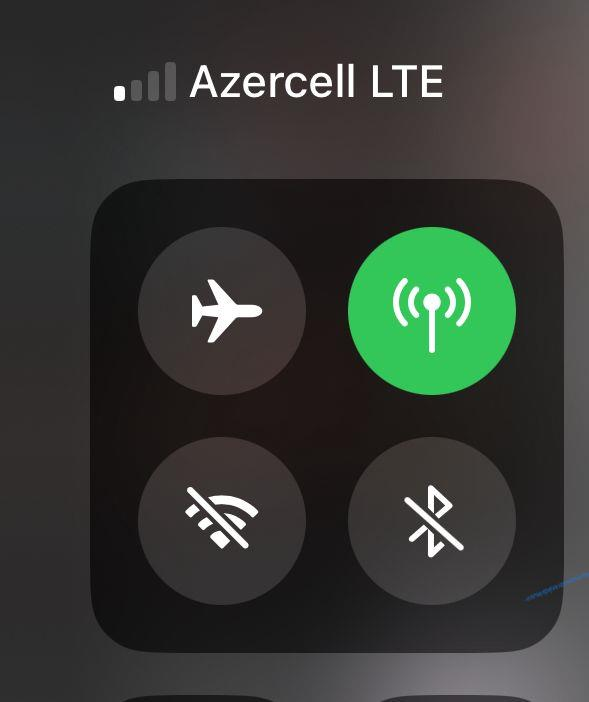
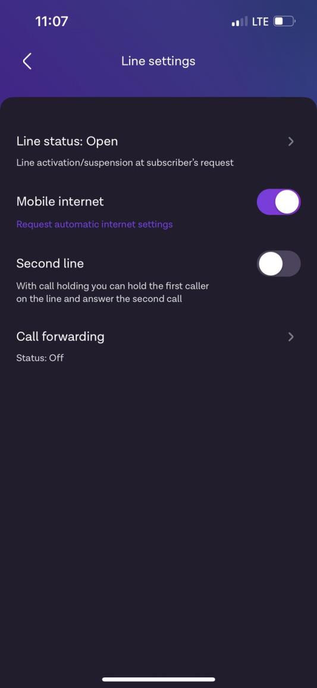
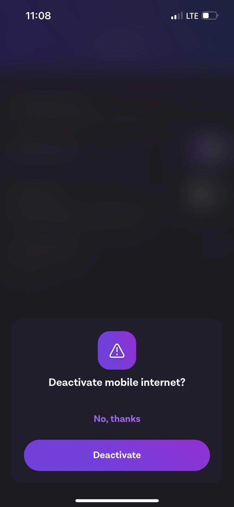
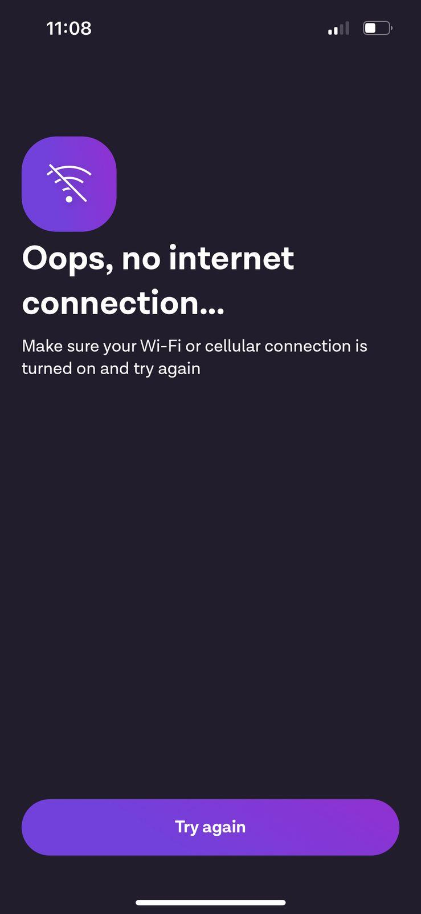

> **Azercell** **“Kabinetim”** **tətbiqinin** **son** **istifadəçi**
> **testinin** **cari** **hesabatı**

**Testin** **məqsədi:** *“Kabinetim”* *tətbiqinin* *funksionallığının*
*tam* *təmin* *olunması.*

> **Testin** **Tarixi**: 08 Aprel 2025 **Testi** **Aparan** **Şəxs**:
> Rəşad Səfərov
>
> **Testin** **Məqsədi**: Mobil tətbiqin əsas funksiyalarının düzgün
> işləyib-işləmədiyini yoxlamaq (Giriş, qeydiyyat,mobil datanın tətbiq
> üzərindən deaktiv edilməsi, ödəniş və s.)
>
> **Testin** **mühiti:**
>
> Cihaz: (İOS)Iphone 13 pro, İphone 15 pro Tətbiqin versiyası: 4.8.0
>
> Əməliyyat sistemi versiyası: IOS 17.6.1; IOS 18.3.2
>
> Testin əhatə etdiyi mövzu: Tətbiq üzərindən mobil datanın
> deaktiv/aktiv edilməsi.
>
> **Testin** **ssenarisi:**
>
> “Kabinetim” tətbiqində (bundan sonra tətbiq.) mobil datanın
> deaktiv/aktiv edilməsini yoxlamaq, funksionallığının tam təmin
> olunmasından əmin olmaq. Giriş:
>
> “Line settings” “Mobile data deactivated”
>
> Gözlənilən nəticə: Mobil data deaktiv olunduqdan sonra rahatlıqla
> aktiv olunması. Real nəticə: Əgər Wi-Fi əlaqəsi yoxdursa, tətbiqə
> ümumiyyətlə girişin mümkün olmaması.
>
> **Qeydə** **alınan** **xətalar:**
>
> Xəta 1: Mobil data deaktiv etmək üçün olan button öz məqsədini ifadə
> edəcək dizaynda deyil və düyməni sıxdıqda çıxan bildiriş ekranı isə
> yetəri qədər məlumatverici deyil ki, istifadəçi fərqinə varsın. Həll
> 1: Bu funksiya üçün daha informativ “pop-up” yerləşdirilməsi və ya bu
> funksiya işləndikdən sonra istifadəçiyə mobil datanı aktiv edə bilməsi
> haqqında dərhal sms yollanmalı.
>
> Xəta 2: Mobil datanın deaktiv olunmasından sonra əgər Wi-Fi əlaqəsi
> yoxdursa, ümumiyyətlə, tətbiqə girişin mümkün olmaması.
>
> Həll 2: Öncəki həlldə qeyd edildiyi kimi, bu funksiyadan dərhal sonra
> informativ sms yollanması və ya əlaqədar departamentin bu
> çatışmazlıqla bağlı daha səmərəli həll təklif etməsi.

> Əlavə
>
> (Burada test ilə bağlı ekran görüntüləri paylaşılacaq)
>
> Sadəcə mobil data üzərindən internetə bağlanan istifadəçi.

> *Ekrana* *çıxan* *bildirişin* *yetərli* *səviyyədə* *informativ*
> *olmaması.*

> *Mobil* *datanı* *yenidən* *aktiv* *etmək* *üçün* *tətbiqə* *girişin*
> *məhdudlaşması.*
