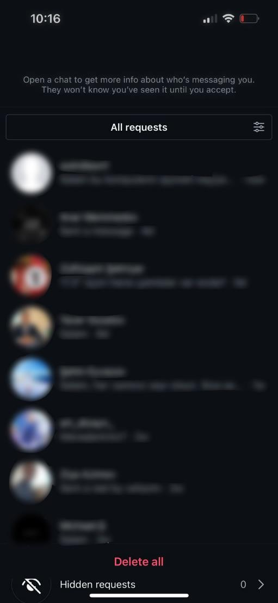
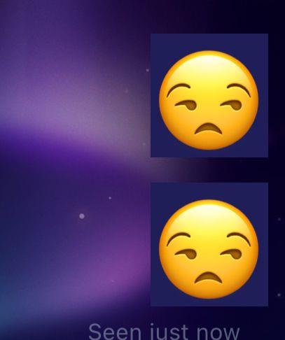

> **Instagram** **bug** **report** **№1**
>
> **Device:** iPhone 13 Pro
>
> **iOS** **Version:** 17.6.1
>
> **App** **Version:** 380.0.0
>
> **Date/Time** **of** **Issue:** 15.05.2025
>
> **Tester:** Rashad Safarov

**Description** **of** **the** **Issue:** The back button disappears
from the pop-up window when clicking on a message notification in a
corporate account.

**Test** **scenario** **applied:** When receiving a message from a
corporate account, check the function to be able to click on the
incoming notification and go back without reading the message.

> **Steps** **reproduce:** Message incoming;
>
> Click “Message” notification; Read message and exit.
>
> **Expected** **result:** Users should be able to receive message
> suggestions without any obstacles, review and accept them, or easily
> go back.

**Real** **result:** Contrary to expectations, the back button for users
to exit the message requests window is missing.

> **Observed** **Bug:**
>
> The disappearance of the back button from the message requests window
> is a bug and should be fixed(Picture is shown in the appendix.).
>
> **Solution**: Concerned department should take action on this bug,
> most likely a UI bug, this bug should be fixed by adding back button
> immediately.

> **Appendix:**
>
> (Screenshots of the test will be shared here.)
>
>  style="width:1.64555in;height:1.94861in" />*As* *you* *can* *see*
> *from* *the* *image,* *the* *back* *button* *has* *been* *omitted*
> *from* *the* *message* *requests* *window.*
>
> **Instagram** **bug** **report** **№2**
>
> **Device:** iPhone 13 Pro
>
> **iOS** **Version:** 17.6.1
>
> **App** **Version:** 380.0.0
>
> **Date/Time** **of** **Issue:** 15.05.2025
>
> **Tester:** Rashad Safarov

**Description** **of** **the** **Issue:** An unexpected colored frame
would appear when using the smiley when the "Sky" background was
selected during chat.

**Test** **scenario** **applied:** Testing several different message
types to test the backgrounds Instagram offers.

> **Steps** **reproduce:** Choose "Sky" background;
>
> Click “Message” and write several types; Send message.

**Expected** **result:** Sending messages without any problems,
obstacles, or errors with any selected background.

**Real** **result:** When the "Sky" background is selected, an unwanted
dark frame appears when sending an emoticon.

> **Observed** **Bug:**
>
> The issue where an unwanted dark frame appears when sending a smiley
> when the "Sky" background is selected is a bug and should be fixed.
> All backgrounds should work smoothly and without conflicts during
> chat. (Picture is shown in the appendix.).
>
> **Solution**: The relevant agency should take action regarding this
> error, and this problem, which is (most likely) an observed UI bug,
> should be resolved.

> **Appendix:**
>
> (Screenshots of the test will be shared here.)

*As* *you* *can* *see* *from* *the* *image,* *an* *unwanted*
*dark-colored* *frame* *appears* *in* *the* *visible* *background* *of*
*the* *message.*
