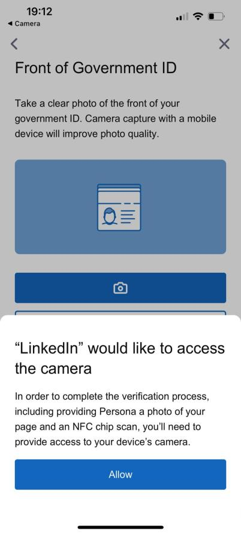

> **Linkedin** **bug** **report**
>
> **Device:** iPhone 13 Pro
>
> **iOS** **Version:** 17.6.1
>
> **App** **Version:** 9.30.9895
>
> **Date/Time** **of** **Issue:** 11.04.2025
>
> **Tester:** Rashad Safarov

**Description** **of** **the** **Issue:** When verifying a LinkedIn
profile in the website (the process of adding a badge to the front of
the profile name), if you accidentally click the "open camera" button,
there is no way to revert.

> **Test** **scenario** **applied:** “The profile verification” process
> on the LinkedIn social network has been tested to ensure that each
> step works without bug.
>
> **Steps** **reproduce:** Log in;
>
> Click “Me” section;
>
> Click “Add vertification badge”; Scan QR code;
>
> Select “Camera” mistakenly.
>
> **Expected** **result:** Seeing a back or cancel button in the "camera
> permission" window that opens by mistake.
>
> **Real** **result:** There is no back or cancel button, only an allow
> button, and the application must be closed and reopened to cancel the
> process.
>
> **Observed** **Bug:**
>
> It is a bug if the user does not have the option to undo any action
> they make by mistake. Closing and reopening the application is not
> allowed for this.
>
> Solution: It should be easier to cancel operation made by mistake, and
> a back button should be added for the customer.

> **Appendix:**
>
> (Screenshots of the test will be shared here.)
>
> *As* *you* *can* *see* *from* *the* *picture,* *there* *is* *no*
> *back* *button* *if* *you* *accidentally* *click* *the* *camera*
> *button.*
