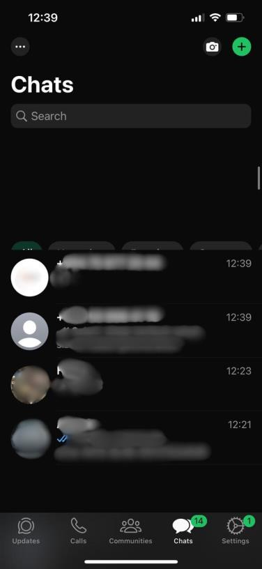

> Whatsapp bug report **№** **1**
>
> **Device:** iPhone 13 Pro
>
> **iOS** **Version:** 17.6.1
>
> **App** **Version:** 25.16.4
>
> **Date/Time** **of** **Issue:** 17.05.2025
>
> **Tester:** Rashad Safarov

**Description** **of** **the** **Issue:** When a voice message arrives
during a chat, the message appears in an unexpected location when the
display changes from landscape to portrait.

**Test** **scenario** **applied:** Testing the symbols that appear on
the screen during chat in different situations.

> **Steps** **reproduce:** Message incoming; Reading message;
>
> Landscape/portrait changing applied mistakenly.

**Expected** **result:** Having any symbol stable and in the intended
places in any situation.

**Real** **result:** Voice message not being in the intended location
when switching from landscape to portrait.

> **Observed** **Bug:**
>
> When changing landscape/portrait, voice recording messages are in an
> unexpected place.
>
> **Solution**: Concerned department should take action on this bug,
> most likely a UI bug, this bug should be fixed by UI Team.
>
> **Appendix:**
>
>  style="width:2.76014in;height:3.63542in" />(Screenshots of the test
> will be shared here.)
>
> Whatsapp bug report **№** **2**
>
> **Device:** iPhone 13 Pro
>
> **iOS** **Version:** 17.6.1
>
> **App** **Version:** 25.16.4
>
> **Date/Time** **of** **Issue:** 17.05.2025
>
> **Tester:** Rashad Safarov

**Description** **of** **the** **Issue:** Unintended movement of chat
list icons when changing landscape/portrait.

**Test** **scenario** **applied:** Testing the symbols that appear on
the screen during chat in different situations.

> **Steps** **reproduce:** Open App;
>
> Landscape/portrait changing applied mistakenly.

**Expected** **result:** Having any symbol stable and in the intended
places in any situation.

**Real** **result:** Unintended movement of chat list icons when
changing landscape/portrait.

> **Observed** **Bug:**
>
> When changing landscape/portrait, chat list icons are in an unexpected
> place.
>
> **Solution**: Concerned department should take action on this bug,
> most likely a UI bug, this bug should be fixed by UI Team.
>
> **Appendix:**
>
>  style="width:1.88472in;height:4.08194in" />(Screenshots of the test
> will be shared here.)
>
> Whatsapp bug report **№** **3**
>
> **Device:** iPhone 15 Pro
>
> **iOS** **Version:** 18.5
>
> **App** **Version:** 25.16.4
>
> **Date/Time** **of** **Issue:** 17.05.2025
>
> **Tester:** Rashad Safarov

**Description** **of** **the** **Issue:** The word "opened" appears
incorrectly in one-time messages.

**Test** **scenario** **applied:** Testing the correct appearance of
characters during chat.

> **Steps** **reproduce:** Open App;
>
> Send audio message; Accept one-time message; Close and stay chat.

**Expected** **result:** Having any symbol stable and in the intended
places in any situation.

**Real** **result:** The word "opened" appears incorrectly after audio
message.

> **Observed** **Bug:**
>
> When we open a one-time message we received immediately after sending
> a voice message, the text opened appears visually incorrect.
>
> **Solution**: Concerned department should take action on this bug,
> most likely a UI bug, this bug should be fixed by UI Team.
>
> **Appendix:**
>
>  style="width:4.57222in;height:1.29156in" />(Screenshots of the test
> will be shared here.)
